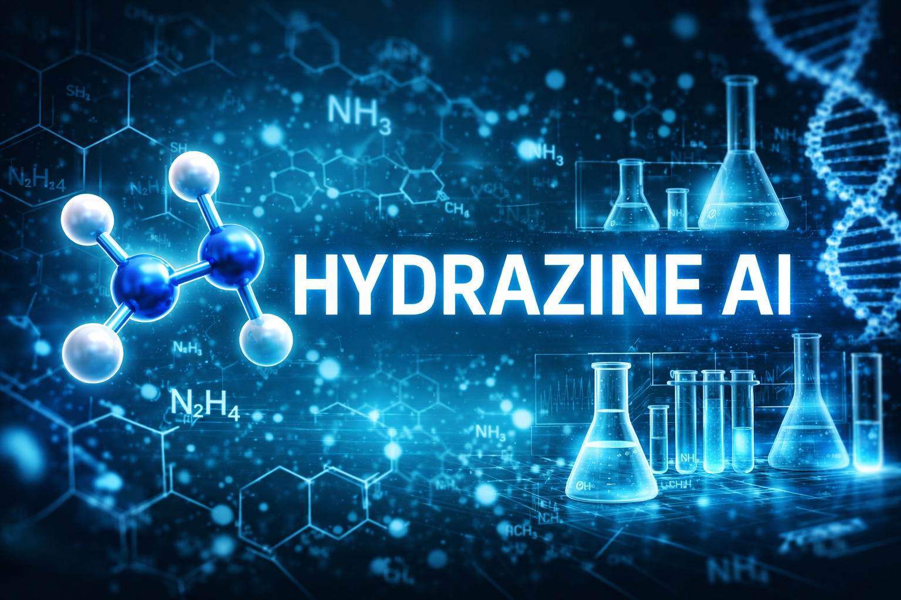

# HYDRAZINE-AI
Hydrazine AI is an advanced, research-driven artificial intelligence platform designed to transform drug discovery and medical prediction.

It is capable of:

Predicting diseases at early stages using data-driven models
Forecasting potential failures in drug manufacturing processes
Estimating the time, cost, and success probability of developing new drugs

The core mission of Hydrazine AI is to reduce uncertainty in pharmaceutical research by identifying risks and inefficiencies before they occur. This enables scientists and pharmaceutical companies to make faster, smarter, and more cost-effective decisions.

Hydrazine AI also provides:

Interactive molecular visualization tools that allow scientists to explore drug structures in detail
Toxicity and efficacy analysis, helping determine whether a drug can effectively target a specific disease
AI-powered insights through an integrated chat interface that explains predictions, reasoning, and outcomes in a transparent way
Automated research report generation (PDFs) to streamline documentation and reduce workload

By combining predictive intelligence, visualization, and explainability, Hydrazine AI empowers doctors and researchers to accelerate the discovery of new medicines—especially for unknown or complex diseases.

 

**TECH STACKS** 

.
.
.

 
 
**ARCHITECTURE** 

